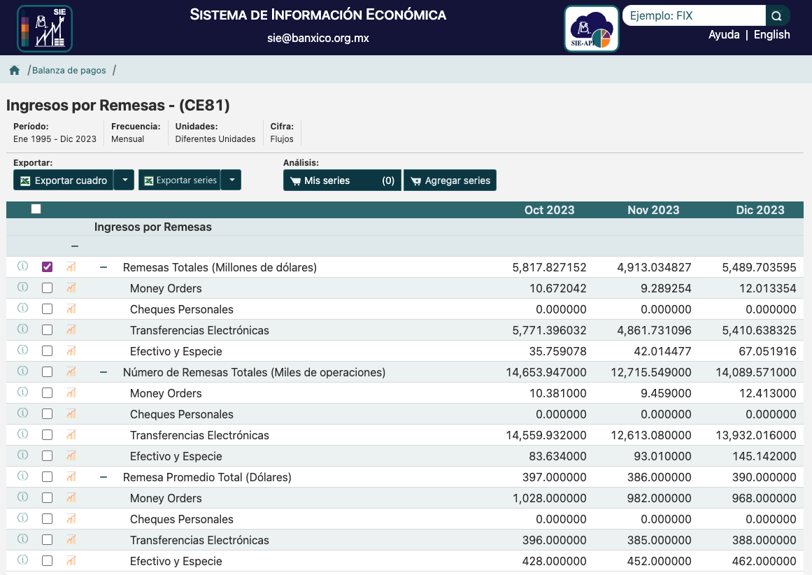
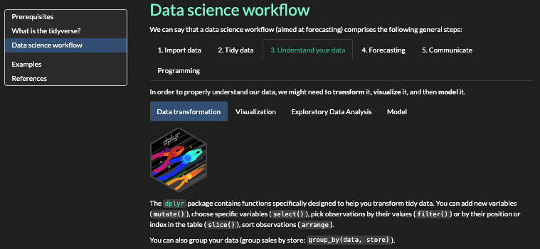
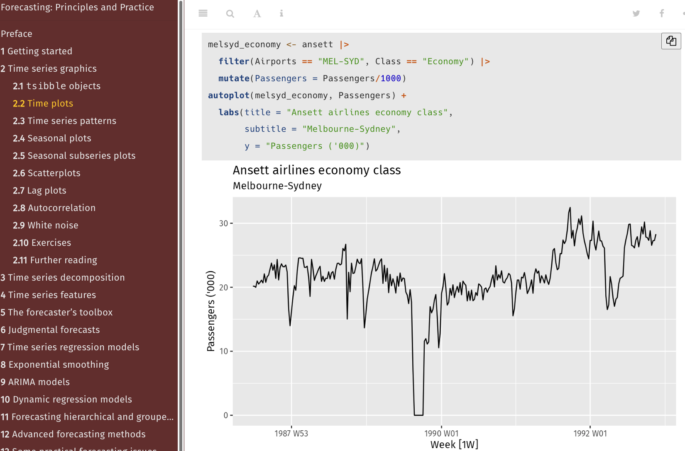
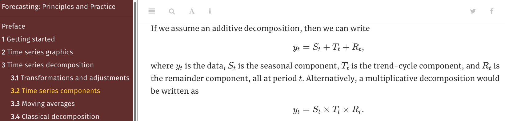

```{r setup, echo = FALSE}
knitr::opts_chunk$set(echo= TRUE,
                      fig.height = 6, fig.width = 7)
```

```{=html}
<style>
.forceBreak { -webkit-column-break-after: always; break-after: column; }
</style>
```
<center>{width="20%"}</center>

# 1) Definición

## La primera actividad de cualquier análisis y pronostico es definir el problema

En el libro Forecasting: Principles and Practice, capítulo primero, describe que es un pronóstico, que se puede pronosticar y cómo definir el problema, y algunos casos de estudios.

Lee más en el capítulo <https://otexts.com/fpp3/determining-what-to-forecast.html>

## Descripción del las remesas

Es el envío de dinero de aquellas personas que radican en otra nación a su país de origen. Por ejemplo, los envíos de dinero que realizan los mexicanos que radican en Estados Unidos y Canadá a sus familias que viven en México.

Con el surgimiento de nuevas herramientas tecnológicas es más sencillo realizar esta transacción y el número de usuarios que la hacen se ha incrementado en los últimos años.

También existen las remesas enviadas por personas que se dedican a los negocios y tienen que pagar sueldos a los empleados contratados en el exterior, por ejemplo. Otra transferencia muy común es para estudiantes que no pueden trabajar y necesitan mantenerse en otro país mientras estudian.

Las remesas son la segunda fuente de divisas más importante de México después de los ingresos por petróleo. Representan cerca de 3% del PIB, 50% de las exportaciones petroleras, 135% de la inversión extranjera directa y 189% de los ingresos de viajeros internacionales.

Los ingresos por remesas provenientes del exterior ascendieron a 4,760 millones de dólares en diciembre de 2021, lo que implicó un aumento anual de 30.4%.

Por su parte, las remesas enviadas por residentes en México al exterior mostraron un crecimiento anual de 1.8%, al alcanzar un nivel de 114 millones de dólares.

Con estos resultados, el superávit de la cuenta de remesas de México con el resto del mundo fue de 4,646 millones de dólares, mayor al de 3,538 millones de dólares que se presentó en diciembre de 2020.

Con series desestacionalizadas, en el último mes de 2021 los ingresos y egresos por remesas exhibieron retrocesos mensuales de 1.9 y 2.3%, en igual orden. Así, en diciembre de 2021 el superávit de la cuenta de remesas se situó en 4,600 millones de dólares, que se compara con el de 4,687 millones de dólares que se observó en noviembre de 2021.

Para la totalidad de 2021, el valor de los ingresos por remesas fue de 51,594 millones de dólares, monto superior al de 40,605 millones de dólares reportado en 2020 y que significó una expansión anual de 27.1%.

Durante 2021, el 98.9% del total de los ingresos por remesas se realizó a través de transferencias electrónicas, al ubicarse en 51,045 millones de dólares. Por su parte, las remesas efectuadas en efectivo y especie2 y las money orders representaron el 0.7 y 0.4% del monto total, respectivamente, al registrar niveles de 333 y 216 millones de dólares, en el mismo orden.

Los egresos por remesas sumaron 1,057 millones de dólares en 2021, cifra mayor a la de 899 millones de dólares observada en 2020 y que implicó un incremento anual de 17.6%.

Con estos resultados, el saldo superavitario de la cuenta de remesas en 2021 fue de 50,537 millones de dólares, cifra superior a la de 39,706 millones de dólares reportada en 2020 y que representó un avance anual de 27.3%.

### Datos

Banco de México registra las remesas como parte de la balanza de pagos y tiene registro mensual desde 1995.

Los datos de Banxico pueden ser descargados en el siguiente [enlace](https://www.banxico.org.mx/SieInternet/consultarDirectorioInternetAction.do?accion=consultarCuadro&idCuadro=CE81&locale=esc)

### Determinar que pronosticar

Se analizara el ingreso total de remesas, como se muestra en la captura siguiente.



### Por que es importante analizar y pronosticar en el contexto social

El flujo de remesas internacionales tiene un efecto importante sobre la actividad económica en algunas entidades que se localizan en las regiones centrales y el sur del país. Esto condujo a que el incremento observado en las remesas haya inducido en 2016 un mayor crecimiento económico en estas regiones.

En efecto, como resultado de los patrones de gasto de los hogares, dichas entidades tienden a ser más propensas a concentrar el impacto de las remesas en las actividades comerciales y los servicios. Adicionalmente, los flujos de remesas contribuyen a suavizar el ingreso de los hogares ante choques sobre la actividad económica, en particular en el sector agropecuario.

**Las remesas son la segunda fuente de divisas más importante de México. En los últimos años las remesas han alcanzado máximos históricos, además, han obtenido mayor atención por las recientes investigaciones que señalan cómo cárteles del narco lavan dinero vía remesas.**

# 2) Datos

## Importar

En las siguientes celdas se muestan los pasos para importar los datos desde mi espacio de trabajo. Por que es un archivo en formato Excel, la librería usada es `readxl`.

Lee más en el notebook introductorio visto en clase: [tidyverse](https://iteso.instructure.com/courses/36673/files/7038386?module_item_id=1527658&fd_cookie_set=1), sección *Data science workflow*, paso *1 Import Data*.

También en el libro [R for Data Science](https://r4ds.hadley.nz/import) capítulo 20.


```{r}
library(readxl)

#raw_data = read_xlsx(path = "/Users/danielnuno/GitHub/time_series_s2024/Analisis/remesas banxico.xlsx", sheet = "Hoja1", col_names = FALSE)
raw_data = read_xlsx(path = "~/GitHub/time_series_s2024/Analisis/remesas/remesas banxico.xlsx", sheet = "Hoja1", col_names = FALSE)

head(raw_data, 20)
```

## Eliminar filas

Los datos no inician hasta la fila 18. Usando `dplyr::slice` se pueden eliminan las primeras 18 filas.

Lee más en el notebook introductorio visto en clase: [tidyverse](https://iteso.instructure.com/courses/36673/files/7038386?module_item_id=1527658&fd_cookie_set=1), sección *Data science workflow*, paso *3 understand your data*.



También en el libro [R for Data Science](https://r4ds.hadley.nz/import) capítulo 27.

```{r}
#raw_data = raw_data[-(1:18), ]
data = dplyr::slice(raw_data, -(1:18))
head(data, 2)
```

## Renombra las columnas

Las dimensiones están nombradas como *...1* y *...2*, por lo tanto es conveniente renombrarlas sin espacios ni caracteres especiales.

```{r}
colnames(data) = c('date', 'value')
head(data, 2)
```

## Cambia el tipo de dato de las columnas

Las columnas son `chr` pero date tiene que ser una fecha mensual y value son millones de dólares. Utiliza `lubridate` para hacer la transformación de la fecha o R básico.

Lee más en el notebook introductorio visto en clase: [tidyverse](https://iteso.instructure.com/courses/36673/files/7038386?module_item_id=1527658&fd_cookie_set=1), sección *Data science workflow*, paso *3 understand your data: data transformation*.

También en el libro [R for Data Science](https://r4ds.hadley.nz/datetimes) capítulo 17.

### Transforma el tipo texto cómo numérico

```{r}
data$date = as.numeric(data$date)
```

### Transforma el número a fecha utilizando el argumento origin

El número representa un día en la serie que inicia el primero de enero de 1990. Por lo tanto utilizamos el argumento origin que indica el inicio de la serie.

```{r}
data$date = as.Date(data$date, origin = "1899-12-30")
```

### Crea una secuencía explicita la periodicidad mensual

```{r}
data$date = seq(from = min(data$date), to = max(data$date), by = "1 month")
library(lubridate)
library(tsibble)
data$date = yearmonth(data$date)
head(data, 2)
```

### Cambia el tipo de dato de la columna value

```{r}
data$value = as.numeric(data$value)
head(data, 2)
```

## Crea un tsibble

Usando `tsibble::as_tsibble()` asigna la fecha como index. En este caso `key` no es necesario pero decide si es importante para tu serie.

Lee más en el notebook introductorio visto en clase: [tidyverse](https://iteso.instructure.com/courses/36673/files/7038386?module_item_id=1527658&fd_cookie_set=1), sección *Data science workflow*, paso *2 Tidy Data*. Y el ejemplo 1.

También la documentación [tsibble](https://tsibble.tidyverts.org/) y el libro [Forecast: Principles and Practice](https://otexts.com/fpp3/tsibbles.html) capítulo 2.1

```{r}
data = as_tsibble(data, index=date, regular=TRUE)
head(data, 2)
```

```{r}
interval(data)
```

### Valores faltantes y factores
Identifica si tu serie de tiempo tiene valores faltantes o factores y has las transformaciones correspondientes con ayuda del libro [R for data science - Transform](https://r4ds.hadley.nz/transform).


# 3) Análisis

## Visualización de la serie

Utiliza ggplot2 para gráficar la serie

Lee más en el notebook introductorio visto en clase: [tidyverse](https://iteso.instructure.com/courses/36673/files/7038386?module_item_id=1527658&fd_cookie_set=1), sección *Data science workflow*, paso *3 Understand your data - visualization*.

Ve los ejemplos y explicaciones vistas en clase: [ggplot2](https://iteso.instructure.com/courses/36673/files/7014501?module_item_id=1525430&fd_cookie_set=1), sección *Gráficas con ggplot2*.


También el libro [Forecast: Principles and Practice](https://otexts.com/fpp3/time-plots.html) capítulo 2.2



### Time plot

```{r}
library(ggplot2)
library(feasts)
feasts::autoplot(data) + ggtitle('Remesas por mes') + ylab('Millones de dólares') + xlab('Fecha')
```


### Patrones

Gráficamente presenta **tendencia**, **estacionalidad** y heteroscedasticidad. Parece presentar **ciclos** relacionados a la actividad económica.

Consulta el libro [Forecast: Principles and Practice](https://otexts.com/fpp3/tspatterns.html) capítulo 2.3

### Gráfica estacionales

Una gráfica estacional es lo mismo que un time plot pero graficada usando los periodos estacionales. En este caso la estacionalidad es mensual.

Consulta el libro [Forecast: Principles and Practice](https://otexts.com/fpp3/seasonal-plots.html) capítulo 2.4

```{r}
data %>% gg_season(value, labels = "both") +
    ggtitle('Remesas por año') + ylab('Millones de dólares') + xlab('Mes')
```

Utiliza `plotly::ggplotly()` hacer gráficos interactivos

```{r}
suppressWarnings(library(plotly))

yearly_data_plot = data %>% gg_season(value, labels = "both") +
    ggtitle('Remesas por año') + ylab('Millones de dólares') + xlab('Mes')

ggplotly(yearly_data_plot)
```

### Sub gráficas estacionales

Un gráfico alternativo que enfatiza los patrones estacionales es aquel en el que los datos de cada temporada se recopilan en minigráficos de tiempo separados.

Consulta el libro [Forecast: Principles and Practice](https://otexts.com/fpp3/subseries.html) capítulo 2.5

```{r}
subseries_plot = data %>% gg_subseries(value)
ggplotly(subseries_plot)
```

### Gráfico de rezagos

Estos gráficos son gráficos de dispersión evaluados en los rezagos de la misma serie que miden la correlación entre periodos. En otras palabras, para esta serie de tiempo mensual, mide la relación de un mes en el tiempo contra un mes (n lags) del pasado.

Consulta el libro [Forecast: Principles and Practice](https://otexts.com/fpp3/lag-plots.html) capítulo 2.7

```{r}
lags_plots = data %>% filter(year(date) > 2018) %>% gg_lag(value, geom = "point", lags = 1:12) + labs(x = "lag(Remesa, k)")

suppressWarnings(ggplotly(lags_plots))
```

### Autocorrelación

Así como la correlación mide el alcance de una relación lineal entre dos variables, la autocorrelación mide la relación lineal entre valores rezagados de una serie temporal.

Consulta el libro [Forecast: Principles and Practice](hhttps://otexts.com/fpp3/acf.html) capítulo 2.8

```{r}
data %>% ACF(value, lag_max = 12)
```

```{r}
data %>% ACF(value, lag_max = 24) %>% autoplot() + labs(title='Remesas por año')
```

Cuando los datos tienen **tendencia**, las autocorrelaciones para desfases pequeños tienden a ser grandes y positivas porque las observaciones cercanas en el tiempo también lo son en valor. Por lo tanto, el ACF de una serie temporal con tendencia tiende a tener valores positivos que disminuyen lentamente a medida que aumentan los rezagos.

Cuando los datos son **estacionales**, las autocorrelaciones serán mayores para los rezagos estacionales (en múltiplos del período estacional) que para otros rezagos.

Sera importante realizar las mismas gráficas una vez que la serie sea estacional.

Además de lo descrito en la primera parte del documento, con las gráficas podemos observar lo siguiente:

Gráficamente presenta **tendencia**, **estacionalidad**. Parece presentar **ciclos** relacionados a la actividad económica.

es interesante observar con este gráfico que a partir del año 2004 los datos se ven separados, es decir, la amplitud de los datos se vuelve más grande en cada año después que pasa. Podemos concluir tres cosas con esto:

- Los primeros siete u ocho años de la serie hay crecimiento, pero a partir del 2003 el crecimiento es exponencial de cómo era antes.
- En esas fechas se volvió más fácil hacer transferencias electrónicas y por lo tanto contabilizarlo en la balanza de pagos.
- El crecimiento puede ser también por la solidaridad de los migrantes.

>En el 2001, en respuesta a la "Sociedad para la prosperidad" entre México y Estados Unidos, el Banco de México y los Bancos de la Reserva Federal de los Estados Unidos acordaron estudiar la posibilidad de interconectar sus sistemas de pagos. La interconexión ha provisto a nuestras economías de un mecanismo eficiente para intercambiar pagos entre cuentas bancarias de ambos países.

>En octubre de 2003, los Bancos de la Reserva Federal de los Estados Unidos y el Banco de México conectaron sus sistemas de pago para el envío de los pagos de los pensionados del Gobierno de los Estados Unidos que radican en México.

>Posteriormente, desde el 2 de febrero de 2004, los usuarios de las instituciones financieras de los Estados Unidos suscritas a Directo a México pueden enviar pagos a cualquier cuenta bancaria en México.

>Desde julio de 2005, este servicio de pagos se registró con el nombre Directo a México

Entonces para considerar como periodos que han afectado la serie de tiempo tenemos:

- 2003-10 facilidad de transferencias electrónicas
- 2007-12, 2009-06 recesión global por crisis hipotecaria
- 2020-02, 2020-04 recesión global por COVID-19
- Apartir del 2018 hay un cambio de tendencia y el crecimieto es acelerado.

Con los gráficos de rezagos podemos apreciar que muestra mayor correlación con el periodo inmediato anterior (1) y el mismo periodo del año pasado (12). Es decir, se espera que se envié una similar cantidad de dinero comparada a estos dos periodos del pasado (1 y 12), pero para el periodo 12 se espera que se envié más dinero.

## Estadística descriptiva
### Medidas de tendencia central

Calcula la media, moda y mediana. Estos estadisticos pueden ser de la totalidad de la serie o por año o por periodo estacional.

```{r}
print(paste('fecha inicial', min(data$date)))
print(paste('fecha final', max(data$date)))
print(paste('observaciones', nrow(data)))
print(paste('existen', sum(is.na(data)), 'datos faltantes'))
```

```{r}
summary(data[, 'value'])
```

Observamos que, por mes, el promedio de millones de dólares es de $1,993.2 millones de dólares, el mínimo fue de $248.1 millones de dólares, mientras que el máximo fue de $5,817.8 millones.

```{r}
boxplot = data %>% 
            mutate(year = year(date)) %>% 
            ggplot(aes(x = as.factor(year), y = value)) + 
            geom_boxplot() + 
            xlab('Año') + 
            ylab('Remesas')

ggplotly(boxplot)
```

### Medidas de dispersión

Estos estadísticos que nos dan información al respecto de la variabilidad o separación de los datos generalmente respecto a la media. Nos ayudan a comprender la distribución de los datos y evitan tomar conclusiones erróneas al comparar distintos grupos.

```{r}
sd(data$value)
```

```{r}
var(data$value)
```

```{r}
library(EnvStats)
kurtosis(data$value)
skewness(data$value)
shapiro.test(data$value)
```

```{r}
library(ggExtra)
p <- ggplot(data, aes(x=date, y=value)) + 
        geom_hline(yintercept =1000) + 
        geom_hline(yintercept =3000) +
        geom_point() + 
        ggtitle('Remesas por mes') + ylab('Millones de dólares') + xlab('Fecha')

ggMarginal(p, type='histogram', margins = 'y')
```

```{r}
histogram = ggplot(data, aes(x = value)) +
  geom_histogram( bins = 20, fill = "black", color = "black", alpha = 0.5) +
  labs(title = "Histograma",
       x = "Value",
       y = "Densidad")

ggplotly(histogram)
```

La distribución presenta un sesgo de simetría negativo a la izquierda y aunque los valores no son tan grandes, alguna transformación sería útil antes de hacer la descomposición de la serie y los pronósticos.

### Valores atípicos

La detección de outliers es importante para afinar nuestro pronóstico y eliminar las observaciones atípicas.
Existen diferentes formas de definir valores atípicos. En este caso, si los outliers son 1.5 veces el rango intercuartílico por encima y debajo del 1 y 3 cuartil, sí hay valores atípicos.

```{r}
ttl_m_dlrs <- data %>% select('value')
ttl_m_dlrs <- as.numeric(unlist(ttl_m_dlrs[,1]))
summary(ttl_m_dlrs)[2] - 1.5*IQR(ttl_m_dlrs) >= summary(ttl_m_dlrs)[1]
summary(ttl_m_dlrs)[5] + 1.5*IQR(ttl_m_dlrs) <= summary(ttl_m_dlrs)[6]
```

```{r}
summary(ttl_m_dlrs)[2] - 3*IQR(ttl_m_dlrs) >= summary(ttl_m_dlrs)[1]
summary(ttl_m_dlrs)[5] + 3*IQR(ttl_m_dlrs) <= summary(ttl_m_dlrs)[6]
```


```{r}
library(tidyverse)

p <- data %>% as_tibble %>% group_by(years=year(date)) %>%
    summarise(remesas=sum(value)) %>%
    arrange(desc(years))%>%
    mutate(change = (remesas/lead(remesas) - 1) * 100) %>% 
    filter(years > 1995) %>% 
    filter(years < 2023)

mean_growth <- data %>% as_tibble %>% group_by(years=year(date)) %>%
                    summarise(remesas=sum(value)) %>%
                    arrange(desc(years))%>%
                    mutate(change = (remesas/lead(remesas) - 1) * 100) %>% 
                    filter(years > 1995) %>% 
                    filter(years < 2022) %>%
                    summarise(mean(change))

mean_growth <- mean_growth$`mean(change)`

ggplot(p, aes(x=years, y=change)) +
    geom_line() +
    geom_hline(yintercept=mean_growth) +
    geom_hline(yintercept=0) +
    ggtitle('Cambio porcentual por año') + ylab('%') + xlab('Mes')
```
El crecimiento promedio es de 11.48%.

# 4) Pronósticos base

## Define los periodos de prueba y entrenamiento

Dependiendo de la cantidad de datos y la periodicidad podrías definir diferente cantidad de observaciones. La regla de pulgar es usar 80% de los datos para entrenar y el restante 20% para validar los resultados.

Para esta serie de tiempo 6 meses de validación son suficientes.

También en el libro [Forecast: Principles and Practice](https://otexts.com/fpp3/toolbox.html) capítulo 5


```{r}
train <- data %>% select(value) %>% filter_index("1995 Jan" ~ "2023 Jun")
test <- data %>% select(value) %>% filter_index("2023 Jul" ~ "2023 Dec")
tstng_prds <- 6
frcst_prds <- 6
```

## Seasonal Naive

En el libro [Forecast: Principles and Practice](https://otexts.com/fpp3/judgmental.html) capítulo 5, y notebook de clase [pronósticos base](https://iteso.instructure.com/courses/36673/files/7130471?module_item_id=1533792&fd_cookie_set=1) se muestran diferentes métodos iniciales para hacer estimaciones. Estos métodos iniciales son ligados a la experiencia en la serie y el análisis exploratorio realizado con anterioridad.

Utilizando la función` fable::SNAIVE` para el primer pronóstico base debido a que hay una clara estacionalidad mensual.

```{r}
library(fable)
models_fit <- train %>% 
    model(`Seasonal naive` = SNAIVE(value))
models_tst <- models_fit %>% forecast(h = tstng_prds)
snaive_plot <- models_tst %>% autoplot(filter_index(data, "2018 Jan" ~ .)) +
    ggtitle('Seasonal Naive') + ylab('Remesas') + xlab('Mes')

snaive_plot
```
### Intervalos de predicción


```{r}
models_tst
models_tst %>% hilo(level = c(80, 95))
```

### Errores de pronóstico

```{r}
accuracy(models_fit)
```

```{r}
(models_fit %>% forecast(h = tstng_prds) %>% accuracy(test))
```

### Diagnostico de resiuales

```{r}
aug = augment(models_fit)
aug
```

```{r}
aug %>% pull(.resid) %>% mean(na.rm = TRUE)
```


```{r}
aug %>% autoplot(.resid) + xlab("Mes") + ylab("") +
  ggtitle("Residuales del método seasonal naïve")
```

```{r}
aug %>%
  ggplot(aes(x = .resid)) +
  geom_histogram() +
  ggtitle("Histograma de los residuales")
```

```{r}
aug %>% ACF(.resid)
```

```{r}
aug %>% ACF(.resid) %>% autoplot() + ggtitle("ACF of residuals")
```

```{r}
train %>% 
  model(SNAIVE(value)) %>% 
  gg_tsresiduals()
```
Observamos que estas gráficas tienen un comportamiento muy distinto al Naïve:

- En la gráfica de los residuales vemos que se distingue claramente un patrón. De hecho, es el mismo patrón exactamente que siguen los datos originales, restándoles su media.

- La función de autocorrelación tiene un comportamiento típico de una caminata aleatoria. Por lo tanto, las autocorrelaciones son significativas.

- El histograma de los residuos muestra claramente que no se distribuyen de manera normal.

### Test de Ljung-Box
Un test relacionado y que, generalmente, es más preciso es el test de Ljung-Box.

En este caso es igual: valores grandes de la prueba son indicios de que las autocorrelaciones no provienen de ruido blanco.

>Entonces, la hipótesis nula de estas pruebas es que la serie en cuestión no está autocorrelacionada. En otras palabras, la H0 dice que la serie es ruido blanco. Si α es el nivel de significancia (el nivel máximo de error que estamos dispuestos a aceptar) y si el ¨p-value <α, entonces rechazamos H0, de lo contrario, no rechazamos la H0.

```{r}
aug %>% features(.resid, ljung_box, lag=12, dof=0)
```


# 5) Descomposición

## Componentes y descomposición STL

Consulta el libro [Forecast: Principles and Practice](https://otexts.com/fpp3/transformations.html) capítulo 3.6

Para estudiar las características de tendencia y estacionalidad se descompone y graficar usando el método STL.
La función per de *periodicity* es la más adecuada al parámetro de suavización estacional *s.windows*. Es el componente estacional es el más pequeño, siendo la tendencia más significativa.

Podemos observar en el componente estacional captura, que el inicio de año es el más flojito y que, a mediados del año es cuando se envían más remesas.

El competente de tendencia y remanentes observamos y confirmamos lo mencionado anteriormente. A partir del 2004 el envío de remesas, o el registro, aumenta considerablemente y el en 2008 y 2020 el remanente es muy significativo. También, a partir del 2020 el componente remanente se acentúa.



> Cleveland, R. B., Cleveland, W. S., McRae, J. E., & Terpenning, I. J. (1990). STL: A seasonal-trend decomposition procedure based on loess. Journal of Official Statistics, 6(1), 3–33. [http://bit.ly/stl1990](http://bit.ly/stl1990)

```{r}
stl_model = data %>% dplyr::select(value) %>% stl(s.window = 'per')
plot(stl_model,main = 'Descomposicón de la serie con STL')
```


## Transformaciones y adjustes

Consulta el libro [Forecast: Principles and Practice](https://otexts.com/fpp3/transformations.html) capítulo 3.1

Ajustar los datos históricos a menudo puede conducir a series temporales más simples. ejemplos de pueden ser ajustes de calendario, ajustes de población, ajustes de inflación y transformaciones matemáticas. El propósito de estos ajustes y transformaciones es simplificar los patrones en los datos históricos eliminando fuentes conocidas de variación o haciendo que el patrón sea más consistente en todo el conjunto de datos. Los patrones más simples suelen ser más fáciles de modelar y conducen a pronósticos más precisos.

Cómo ya se mencionó anteriormente con el histograma, y con observar las magnitudes de los valores al inicio y final de la serie es conveniente una transformación de potencia. El histograma y el sesgo también muestra sesgo negativo. Además, la prueba de normalidad SHAPIRO-WILK (alpha = 0.05)


```{r}
qqnorm(data$value)
qqline(data$value)
```

Valor p es menor que Alpha entonces no tenemos una distribución normal. De hecho, estamos lejos de una distribución normal pero el sesgo no esta tan mal siendo 0.5. Queremos lo más acercado a 0 de sesgo.

Aunque se puede entender y usar la transformación box cox para transformar una distribución no normal a una normal, el principal objetivo es corregir sesgos y varianzas desiguales de la siguiente manera:

$$
y(\lambda) =\begin{cases}
    \frac{(y^\lambda - 1)}{\lambda}& \lambda \neq 0 ,\\
    log(y)&   \lambda = 0.
    \end{cases}
$$

El lambda óptimo se encuentra cuando se encuentra la distribución con el máximo loglikelihood o con el coeficiente del gráfico de probabilidad de correlación o Shapiro-Wilk.

> Bickel, P. J., & Doksum, K. A. (1981). An analysis of transformations revisited. Journal of the American Statistical Association, 76(374), 296–311. [DOI](https://doi.org/10.1080/01621459.1981.10477649)
> 
> Box, G. E. P., & Cox, D. R. (1964). An analysis of transformations. Journal of the Royal Statistical Society. Series B, Statistical Methodology, 26(2), 211–252. [DOI](https://doi.org/10.1111/j.2517-6161.1964.tb00553.x)


```{r}
bc <- EnvStats::boxcox(data$value, lambda=c(-2, 2), optimize=TRUE, objective.name='Log-Likelihood')
bc_data <- EnvStats::boxcoxTransform(data$value, bc$lambda)

skewness(bc_data)
shapiro.test(bc_data)
qqnorm(bc_data)
qqline(bc_data)

data <- data %>% mutate('remesas_trn' = bc_data)
```


# 6) Pronósticos base con STL y tranformación matemática

## STL Seasonal Naive

```{r}
models_fit <- train %>% 
  model(stlf = decomposition_model(
    STL(value ~ trend(window = 12), robust = TRUE),
    NAIVE(season_adjust)
  ))
models_tst <- models_fit %>% forecast(h = tstng_prds)
mape_sn <- (models_fit %>% forecast(h = tstng_prds) %>% accuracy(test))$MAPE
snaive_plot <- models_tst %>% autoplot(filter_index(data, "2018 Jan" ~ .)) +
    ggtitle('STL') + ylab('Remesas') + xlab('Mes')

snaive_plot
```
```{r}
?decomposition_model
```

```{r}
models_fit <- train %>% 
  model(stlf = decomposition_model(
    STL(log(value) ~ trend(window = 12), robust = TRUE),
    NAIVE(season_adjust)
  ))
models_tst <- models_fit %>% forecast(h = tstng_prds)
mape_sn <- (models_fit %>% forecast(h = tstng_prds) %>% accuracy(test))$MAPE
snaive_plot <- models_tst %>% autoplot(filter_index(data, "2018 Jan" ~ .)) +
    ggtitle('Seasonal Naive') + ylab('Remesas') + xlab('Mes')

snaive_plot
```


```{r}
models_fit <- train %>% 
  model(
    `Seasonal naive` = SNAIVE(value),
    stlf = decomposition_model(
    STL(value ~ trend(window = 12), robust = TRUE),
    NAIVE(season_adjust)),
    log_stlf = decomposition_model(
            STL(log(value) ~ trend(window = 12), robust = TRUE),
            NAIVE(season_adjust))
  )
models_tst <- models_fit %>% forecast(h = tstng_prds)
mape_sn <- (models_fit %>% forecast(h = tstng_prds) %>% accuracy(test))$MAPE
snaive_plot <- models_tst %>% autoplot(filter_index(data, "2018 Jan" ~ .), level = NULL) +
    ggtitle('Diferentes modelos') + ylab('Remesas') + xlab('Mes')

snaive_plot
```

```{r}
models_tst
models_tst %>% hilo(level = c(80, 95))
```

```{r}
accuracy(models_fit)
```

```{r}
train %>% 
  model(decomposition_model(
            STL(log(value) ~ trend(window = 12), robust = TRUE),
            NAIVE(season_adjust))) %>% 
  gg_tsresiduals()
```


```{r}
models_fit[3] %>% gg_tsresiduals()
```

# 7) Regresión Lineal

## Datos

La hipótesis radica en la relación y crecimiento económico de Estados Unidos precede y esta correlacionado a el incremento de remesas. Por lo que el índice **Brave-Butters-Kelley** puede ser relevante para la estimación de las remesas.

>The Brave-Butters-Kelley Indexes (BBKI) are a research project of the Federal Reserve Bank of Chicago. The BBK Coincident and Leading Indexes and Monthly GDP Growth for the U.S. are constructed from a collapsed dynamic factor analysis of a panel of 500 monthly measures of real economic activity and quarterly real GDP growth.

Los datos mensuales se pueden obtener de la FRED. [https://fred.stlouisfed.org/series/BBKMGDP](https://fred.stlouisfed.org/series/BBKMGDP)

Importar los datos usando tidyquant
```{r}
library(tidyquant)
gdp_us = tq_get("BBKMGDP", get="economic.data", from = "1995-01-01")
```

Convertir la fecha y a tsibble
```{r}
gdp_us$date = yearmonth(gdp_us$date)
gdp_us = gdp_us %>% select(date, price) %>% as_tsibble(index=date, regular = TRUE)
gdp_us
```
Convertir el cambio percentual a base 100 con la suma acumulada de los cambios porcentuales

```{r}
gdp_us = gdp_us %>% mutate(gdp_base = cumsum(price))
```


```{r}
gdp_us
```

separas entre entrenamiento y prueba

```{r}
train_gdp <- gdp_us %>% select(gdp_base) %>% filter_index("1995 Jan" ~ "2023 Jun")
test_gdp <- gdp_us %>% select(gdp_base) %>% filter_index("2023 Jul" ~ "2023 Dec")
```

Renombrar las columnas
```{r}
train_gdp = add_column(train_gdp, train$value) #append remesas
colnames(train_gdp)[3] = "remesas" 
colnames(train_gdp)[1] = "gdp"
test_gdp = add_column(test_gdp, test$value)
colnames(test_gdp)[3] = "remesas"
colnames(test_gdp)[1] = "gdp"
```

Gráfica de ambas series a traves del tiempo

```{r}
train_gdp |>
  pivot_longer(c(remesas, gdp), names_to="Series") |>
  autoplot(value) +
  labs(y = "% change")
```

Gráfica de disperción (correlación) entre ambas series

```{r}
train_gdp %>% ggplot(aes(x = gdp, y = log(remesas))) +
  labs(y = "Remesas",
       x = "GDP Base 1") +
  geom_point() +
  geom_smooth(method = "lm", se = FALSE)
```

Ajuste de regresión y reporte del modelo

```{r}
fit_lm <- train_gdp |>
  model(tslm = TSLM(log(remesas) ~ gdp))

report(fit_lm)
```


Tabla aumentada del ajuste del modelo

```{r}
augment(fit_lm)
```


```{r}
plot_lm = augment(fit_lm) |>
  ggplot(aes(x = date)) +
  geom_line(aes(y = remesas, colour = "reales")) +
  geom_line(aes(y = .fitted, colour = "ajustados")) +
  labs(y = NULL,
    title = "remesas"
  ) +
  guides(colour = guide_legend(title = NULL))
ggplotly(plot_lm)
```


Zoom a la gráfica despues de 2018
```{r}
augment(fit_lm) |> filter(year(date) > 2018) %>%
  ggplot(aes(x = date)) +
  geom_line(aes(y = remesas, colour = "reales")) +
  geom_line(aes(y = .fitted, colour = "ajustados")) +
  labs(y = NULL,
    title = "remesas"
  ) +
  guides(colour = guide_legend(title = NULL))
```
Analisis de residuales

Primera gráfica: errores en el tiempo para evaluar media y varianza.
Segunda gráfica: autocorrelación de errores: errores en el pasado afectan el valor actual.
tercera gráfica: histograma de errores para verificar la normalidad, media sea 0 y sesgo sea 0.

```{r}
fit_lm %>% gg_tsresiduals()
```

```{r}
augment(fit_lm) %>% features(.innov, ljung_box, lag=12)
```
Los residuales estan autocorrelacionados, no son homocedasticos y la media de los errores no es cero.

Gráfica de residuales contra valores ajustados. También sirve para identificar outliers

```{r}
augment(fit_lm) %>% ggplot(aes(x=.fitted, y=.resid)) + geom_point() + labs(x="Fitted", y="Residuals")
```

Los datos de ambas variables no son estacionarias, es decir tienen tendencía. Y puede ser que ningua tenga relación con la otra ni sea causal de la otra.

Regresiones con relaciones espurias puede que funcionen en el corto plazo pero dejen de funcionar en el futuro.

Pronósticos

```{r}
test_gdp[c("gdp", "date")]
```


```{r}
fc_lm = forecast(fit_lm, new_data = test_gdp[c("gdp", "date")])
data %>% autoplot(value) + autolayer(fc_lm)
```
```{r}
fc_lm
```
